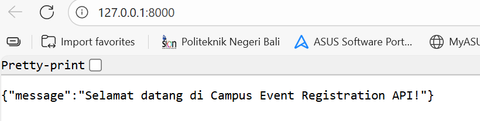
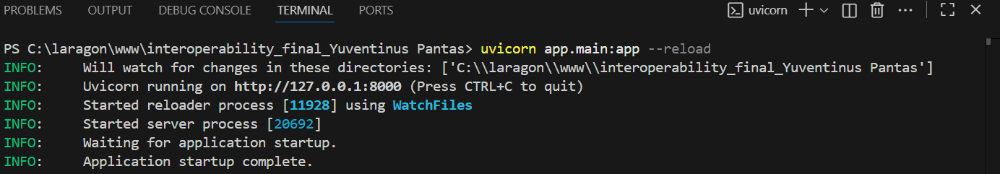
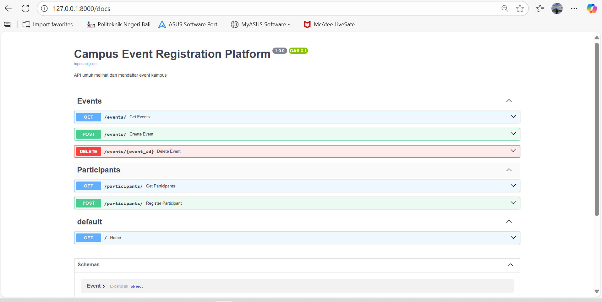
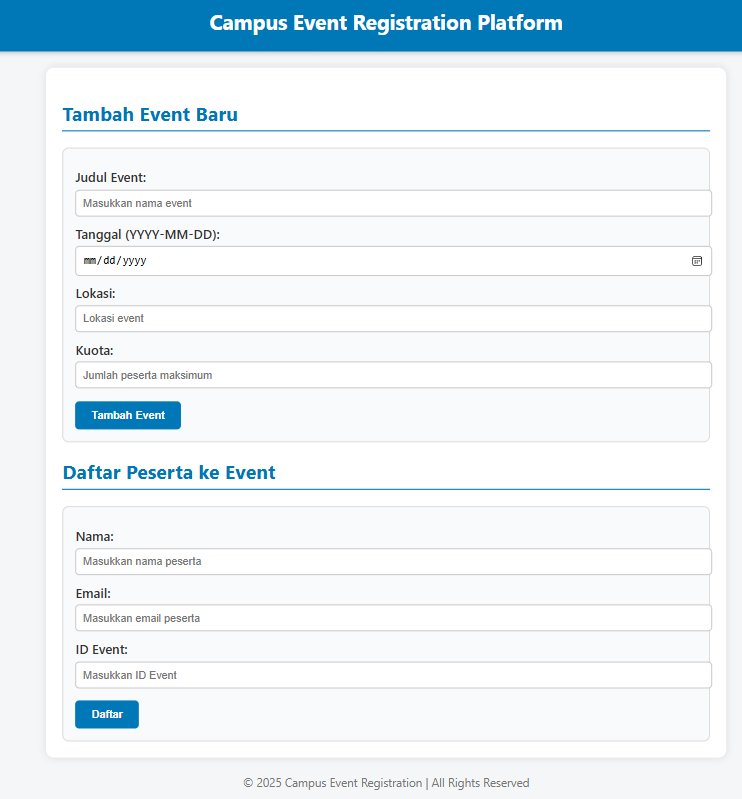

# Campus Event Registration Platform

## Deskripsi Proyek

Proyek ini adalah sistem sederhana untuk **melihat dan mendaftar event kampus**. Sistem ini menunjukkan interoperabilitas antara beberapa komponen:

- **Backend REST API** menggunakan **FastAPI**
- **Database** menggunakan **SQLite**
- **Frontend/Client** menggunakan **HTML sederhana**

Fitur utama:

1. Melihat daftar event kampus
2. Menambahkan event baru
3. Menghapus event
4. Melihat daftar peserta
5. Mendaftar sebagai peserta
6. Validasi kuota event

#Strukturnya:
interoperability_final_Yuventinus_Pantas/
│
├── app/
│ ├── **init**.py
│ ├── main.py
│ ├── database.py
│ ├── models.py
│ ├── schemas.py
│ └── routes/
│ ├── **init**.py
│ ├── event.py
│ └── participant.py
│
├── img/ # Folder untuk screenshot
│ ├── SS_1.png # Screenshot daftar API
│ ├── SS_2.png # Screenshot menjalankan backend
│ ├── SS_3.png # Screenshot API docs (/docs)
│ └── SS_4.png # Screenshot tambah event baru dan tambah peserta ke event
│
├── index.html # Frontend HTML sederhana
├── create_db.sql # Script SQL untuk membuat database
├── init_db.py # Script inisialisasi database (opsional)
├── requirements.txt # Dependencies Python
└── README.md # Dokumentasi proyek lengkap

---

## Screenshot

### Frontend - Daftar Event

### Frontend - Tambah Event

### Frontend - Daftar Peserta

### Swagger / API Docs

